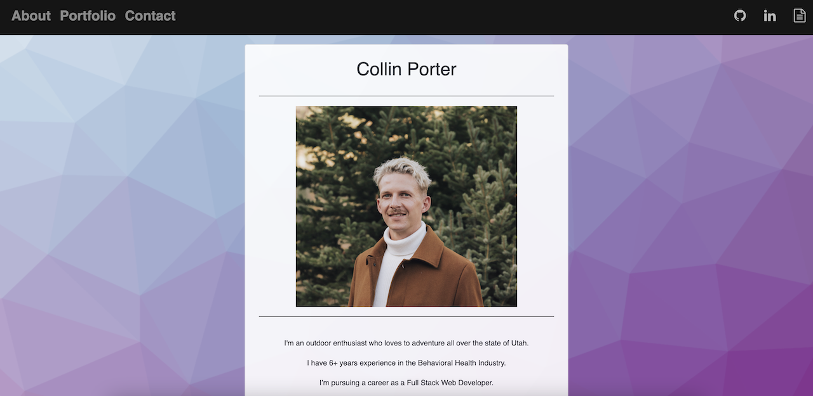
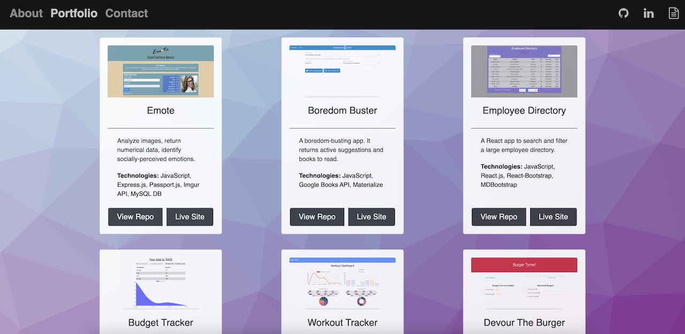
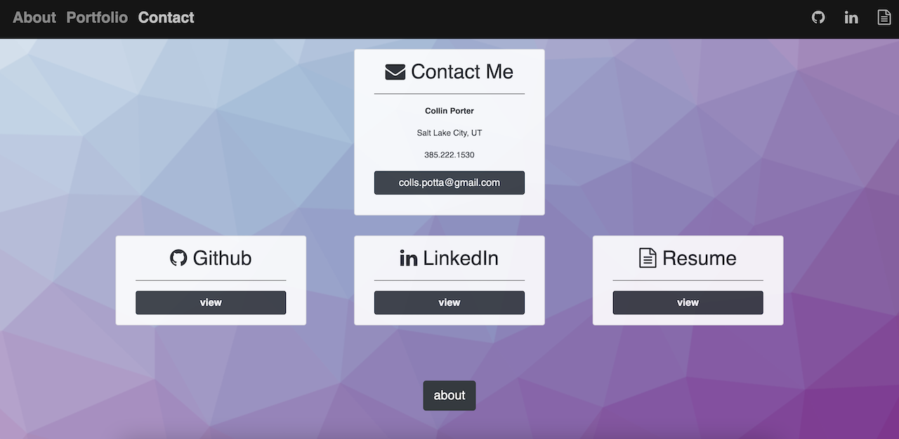

# React Portfolio

Link to deployed site: [React Portfolio](https://damp-citadel-41611.herokuapp.com/)

## Description
An updated portfolio using React.js, Bootstrap and new CSS framework. Using 3 components that appear on multiple pages; Header, Project & Footer. This porfolio featuers an updated navbar, project cards and contact cards/info. You can find my updated github, linkedIn and resume info in the navbar or on the contact page.

## App Images
About Me

Portfolio

Contact

## Technologies
1. React.js
2. Bootstrap